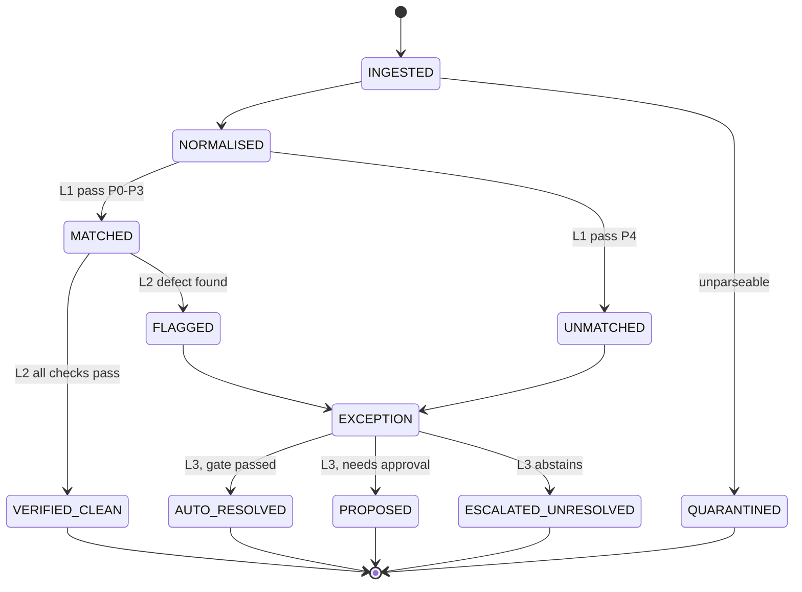
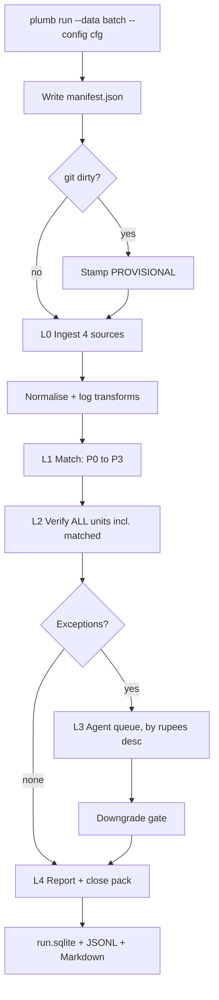
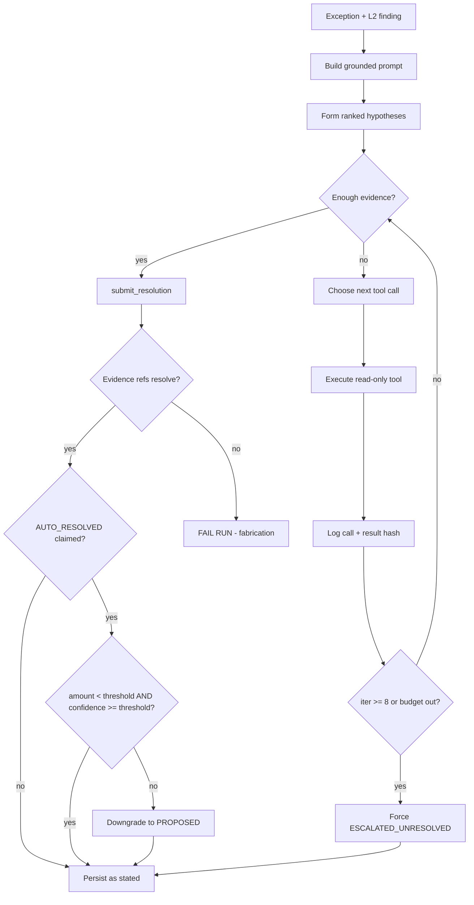
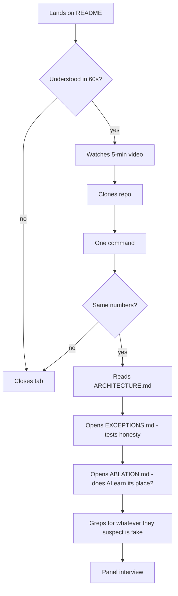

# Plumb — App Flow

Third document. `PLUMB_PRD.md` defines what and why. `PLUMB_TRD.md` defines how. This defines **what actually happens, in what order, and what the human sees at each step.**

Plumb has no GUI (PRD §13). Its surfaces are the **terminal** and the **report artifacts**. Those are the screens. Design them as such.

---

## 0. The two users

Plumb has two distinct users, and both flows have to work.

| | **U1 — Priya, finance lead** | **U2 — the panelist** |
|---|---|---|
| Who | Runs settlement close at a Route marketplace | Evaluates the submission |
| Wants | To trust the books and find leaked money | To find out if this is real in under 15 minutes |
| Enters via | `plumb run` | The README |
| Succeeds when | She has an exception list she can act on | She fails to catch you overstating anything |

**U2 is the user who decides the outcome.** §5 designs for her explicitly.

---

## 1. Record lifecycle — the core state machine

This is the single most important diagram in the project, because it encodes the product thesis in one place: **`MATCHED` is not a terminal state.**



Three things this makes visible, and each is worth saying out loud in the pitch:

1. **`MATCHED → FLAGGED` is the arrow no competitor has.** Everyone else's matched records go straight to done. Ours get verified.
2. **`ESCALATED_UNRESOLVED` is a terminal success state**, drawn identically to the others. Not an error path.
3. **`QUARANTINED` exists.** Bad rows are counted and reported, never silently dropped.

Every record ends in exactly one terminal state. The counts across all terminal states must equal total records ingested — assert this, and print it in the report as a conservation check.

---

## 2. Pipeline flow



**Ordering rule inside L3:** the exception queue is processed **descending by `amount_at_risk_paise`**. If the token budget runs out, what remains unprocessed is the cheapest, not a random tail. Anything skipped for budget is emitted as `ESCALATED_UNRESOLVED` with the reason recorded — never dropped.

---

## 3. The agent investigation loop

Per exception. Cap: 8 iterations, hard.



Three gates worth understanding, because they're the difference between an agent and a chatbot:

- **The fabrication gate (J).** Every evidence reference must resolve to a real record key. One that doesn't fails the entire run. This is not a warning.
- **The downgrade gate (O).** The model can *request* autonomy. Code *grants* it. If the amount or confidence is out of bounds, the engine overrides `AUTO_RESOLVED` to `PROPOSED` regardless of what the model concluded.
- **The budget stop (H).** Running out is a legitimate outcome with a recorded reason, not a crash and not a silent partial answer.

### 3.1 What "enough evidence" means

The model decides adaptively — that's requirement 2 in PRD §10.2 and one of the things a rules engine cannot do. But it must justify stopping: `what_was_tried` describes the evidence path taken and why it was sufficient or why it wasn't.

---

## 4. U1 — Priya's close flow

What she runs, and what she sees.

### Step 1 — Run the close
```
$ plumb run --data data/aug_2026 --config configs/default.yaml
```

Terminal shows a live progress line per layer. **No spinners without numbers** — every stage prints counts as it completes:
```
L0  ingest      812 records from 4 sources    (4 quarantined)
L1  match       738 matched (90.9%)  ·  74 unmatched
L2  verify      812 units verified  ·  31 findings  ·  ₹47,300 at risk
L3  investigate 105 exceptions  ·  62 resolved  ·  28 proposed  ·  15 escalated
L4  report      reports/2026-08-28T14:22:03Z-a3f9c1/
```

The L2 line is the one that should stop her. **31 findings across 812 units, of which most sit on records that matched cleanly.** Print that breakdown explicitly:
```
    of 31 findings: 24 on MATCHED records, 7 on UNMATCHED
```

That single line is the product's whole argument, rendered as output.

### Step 2 — Read the close pack
`close.md` opens with the cash position waterfall, ending on the held bucket:
```
ON HOLD (no release date)     ₹ 2,14,000    ← 6 transfers, oldest 47 days
```
Money she collected and cannot see. For most finance leads this is the first time it's been surfaced as a number.

### Step 3 — Work the exception list
`exceptions.md`, sorted by rupees descending. Each entry gives her what was tried, what would resolve it, and the recompute trace. She does not start any investigation cold.

### Step 4 — Act
`PROPOSED` items carry a full evidence chain for approval. `ESCALATED_UNRESOLVED` items name the missing input. **Plumb never writes anything back** (PRD §10.5) — Priya remains the actor.

---

## 5. U2 — the panelist's flow

The repo is the product being judged. Design the path through it.



### 5.1 The first 60 seconds

README, in this order, above the fold:

1. **The one-loop statement**, verbatim from PRD §2.1
2. **One sentence of positioning:** *Reconciliation proves the numbers tie. Plumb proves they're right.*
3. **The headline metrics table**, every row labelled `HELD_OUT`, auto-match rate **first**
4. **The one command**
5. Then everything else

If a panelist cannot state what this does after 60 seconds, the rest never happens.

### 5.2 The one command

```
$ make reproduce
```

Generates from committed seeds, runs both ablation arms, scores, prints the metrics table. Must work on a clean clone with **no API key** (TRD §9.1). Test this on a fresh container before submitting — not on your machine, where something is always already installed.

### 5.3 The three things she'll try to catch you on

Design the answer to each into the repo, in advance:

| Suspicion | Where it's answered |
|---|---|
| *"You graded your own homework"* | The import-boundary AST test. Point at it in ARCHITECTURE.md. |
| *"Your numbers are hand-tuned"* | `HELD_OUT` labels + `config_a` vs `config_b` + `reports/history.jsonl` showing metrics across the whole build |
| *"The LLM is decorative"* | `ABLATION.md` — with the prediction written before the run and the actual result after |

### 5.4 What EXCEPTIONS.md is for

It is not an appendix. It is the honesty test, and she will open it early.

Requirements: sorted by rupees, no truncation, **₹ escalated as a percentage of ₹ processed stated in the header**. If that number is uncomfortable, print it anyway. A submission that reports 15% escalated with a clear reason for each is stronger than one reporting 2% that nobody believes.

---

## 6. Demo flow — the 5-minute video

Beat sheet with timings. Rehearse against a clock.

| Time | Beat | On screen |
|---|---|---|
| 0:00–0:35 | **The hook.** A settlement that reconciles perfectly. Bank credit matches to the paisa. Every tool on the market closes this. | Two files side by side, tying out |
| 0:35–1:05 | **The turn.** Here is the ₹4,180 missing from it. Which line, what the contracted rate was, the recomputation, the evidence. | `recompute_trace`, step by step |
| 1:05–1:20 | **The scale.** 23 more like it in this batch. ₹47,300 total. | `findings.jsonl` summary |
| 1:20–2:10 | **The architecture, in one breath.** Four layers. L1 and L2 are deliberately not AI — they're pure functions, determinism 1.000. The agent runs only on the residual. | The state machine from §1 |
| 2:10–3:10 | **The metrics.** Auto-match rate first — their word. Then match precision. Then silent-error rate, and what it means. | Metrics table, `HELD_OUT` visible |
| 3:10–4:00 | **The ablation.** Rules-only vs LLM-only vs hybrid. What was predicted, what happened. | `ABLATION.md` |
| 4:00–4:35 | **The exception list.** Here is what it could not resolve, and why. Read one aloud. | `exceptions.md` |
| 4:35–5:00 | **The close.** Read-and-recommend only — a control decision, not a limitation. What breaks next and what you'd build. | Cash position, held bucket |

### 6.1 Rules for the video

- **No UI tour.** There is no UI. Lead with the missing money.
- **No cherry-picking.** Every number on screen comes from a batch run, and the batch size is visible. Their bar says one cherry-picked match proves nothing — do not hand them one.
- **Say "cash position," never "forecast."**
- **Do not apologise for the exception list.** Present it as the point. Tone: *this is what the system knows it doesn't know.*
- Record the terminal live. A real run is more persuasive than any slide.

---

## 7. Failure flows

What the user sees when things go wrong. Each of these is a designed path, not an unhandled case.

| Failure | Behaviour | Surface |
|---|---|---|
| Source file unparseable | Row → `QUARANTINED` with reason; run continues | Count in L0 line + report |
| Rate card missing for a seller/date | Finding: cannot verify obligation → exception, not a crash | Exception list, distinct reason |
| Tool call errors or times out | Retry once, then `ESCALATED_UNRESOLVED` with failure in `what_was_tried` | Exception list |
| Token budget exhausted mid-queue | Remaining exceptions → `ESCALATED_UNRESOLVED`, reason `budget_exhausted` | Report header states how many |
| Evidence reference doesn't resolve | **Run fails.** Fabrication is not recoverable. | Loud error, non-zero exit |
| Truth join fails in scorer | **Scoring fails.** | Loud error |
| LLM cassette miss in CI | Build fails with instructions to re-record | CI log |
| Razorpay fixture missing | Fall back to fixture; **never** a live call in test/CI | Clear error |

**Design principle:** fail loudly at boundaries, degrade gracefully inside the agent loop. One flaky tool call must never take down a batch — and a fabricated number must always take down a run.

---

## 8. Config flow

Which knobs exist, who sets them, and where they surface.

| Config | Set by | Surfaces in |
|---|---|---|
| `tolerance_profile` | Engine config | Report header + manifest — **must be visible; D02 is defined relative to it** |
| `auto_resolve_threshold_paise` | Engine config | Report header |
| `confidence_threshold` | Engine config | Report header |
| `max_agent_iterations` | Engine config (8) | Manifest |
| `token_budget_per_exception` | Engine config | Manifest |
| `ablation_config` | CLI flag | Manifest + every metrics row |
| `seed`, generator config | CLI flag | Manifest |
| `llm_model`, `temperature` | Env + config | Manifest |

**Rule: any config that changes a reported number must appear in the report header, not only the manifest.** A panelist reading `metrics.md` alone must be able to see the tolerance band that a match rate was computed under. Burying it one file away looks like hiding it.

---

## 9. Flow-level acceptance checks

Ship-blocking. Verify each end to end before submission.

1. Terminal-state counts sum to records ingested (conservation check prints in report)
2. `make reproduce` on a **fresh container**, no API key, reproduces every headline number
3. Every `ESCALATED_UNRESOLVED` has a non-null `what_would_resolve_it`
4. Every `AUTO_RESOLVED` passes the downgrade gate on re-validation
5. A deliberately corrupted evidence reference fails the run — test this, don't assume it
6. T4 null-set run produces **zero** findings and zero exceptions
7. The video's every on-screen number traces to a committed report
8. README's headline metrics equal the latest committed `metrics.json`

Check 8 sounds trivial and is the one most likely to break. The README will drift as metrics improve. **Automate it**: a CI step that fails if README numbers and `metrics.json` disagree.
